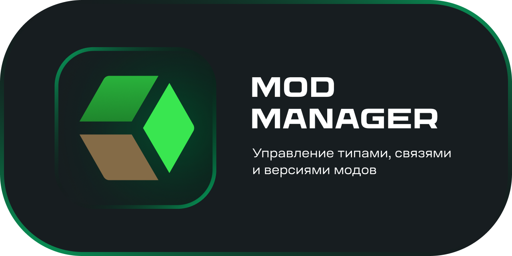

<p align="center">
  
</p>

# Mod Manager

Native Tauri desktop app for keeping Minecraft modpack metadata outside jar
filenames. Mod tags, dependencies, version and provider switching
(Modrinth / CurseForge) — all in one place.

## Download (prebuilt binaries)

Prebuilt installers for macOS and Windows are published to a separate releases
repo:

<https://github.com/crococrystal/mod-manager-releases/releases/latest>

Linux is not produced by CI yet — see the build instructions below.

## Features (current MVP)

- Pick a PrismLauncher instance or a raw `minecraft/mods` folder.
- Scan jar files and `.index/*.pw.toml` metadata natively in Rust.
- Store labels in `<instance>/.mod-manager/mod-tags.json`.
- Edit side, library / optimization flags, description, manual dependencies.
- Compute `usedBy` from dependencies instead of storing reverse links by hand.
- Service actions (open `mods`, check pack integrity, wipe data) inside
  Settings.

## Tech stack

- Tauri 2 (Rust backend + system webview)
- React 19 + Vite 6 (UI)
- Rust 2021 edition (`src-tauri/`)

---

## Build & install on Linux

The app is written with Tauri 2 and should build on any modern x86_64
distribution. The instructions below are tested on Ubuntu 22.04 / 24.04 and
Debian 12; package names for other distros are listed at the end of the
section.

### 1. Install build prerequisites

Tauri 2 on Linux requires a WebKitGTK 4.1 stack plus the usual C/C++ toolchain.

```bash
sudo apt update
sudo apt install -y \
  build-essential \
  curl \
  wget \
  file \
  git \
  pkg-config \
  libssl-dev \
  libwebkit2gtk-4.1-dev \
  libayatana-appindicator3-dev \
  librsvg2-dev \
  libxdo-dev \
  libsoup-3.0-dev \
  libjavascriptcoregtk-4.1-dev
```

### 2. Install Rust (stable)

```bash
curl --proto '=https' --tlsv1.2 -sSf https://sh.rustup.rs | sh -s -- -y
source "$HOME/.cargo/env"
rustup default stable
```

Check the version (should be 1.77+):

```bash
rustc --version
cargo --version
```

### 3. Install Node.js 20+

The CI uses Node 20. Either install from your distro repository, from NodeSource,
or via `nvm`:

```bash
# Option A — NodeSource
curl -fsSL https://deb.nodesource.com/setup_20.x | sudo -E bash -
sudo apt install -y nodejs

# Option B — nvm
curl -o- https://raw.githubusercontent.com/nvm-sh/nvm/v0.40.1/install.sh | bash
exec $SHELL
nvm install 20
nvm use 20
```

Verify:

```bash
node --version   # v20.x or later
npm --version
```

### 4. Get the sources

```bash
git clone https://github.com/crococrystal/mod-manager.git
cd mod-manager
```

### 5. Install npm dependencies

Use `npm ci` to get the exact versions from `package-lock.json`:

```bash
npm ci
```

### 6. Run from source (development mode)

This launches the Vite dev server and Tauri in one process with hot reload:

```bash
npm run tauri dev
```

The first build is slow (Rust compiles all dependencies once). Subsequent
launches are fast thanks to Cargo's incremental cache.

### 7. Build a release binary

```bash
npx tauri build
```

By default Tauri produces:

- `src-tauri/target/release/mod-manager` — the stand-alone executable
- `src-tauri/target/release/bundle/deb/*.deb` — Debian / Ubuntu package
- `src-tauri/target/release/bundle/rpm/*.rpm` — Fedora / RHEL package
- `src-tauri/target/release/bundle/appimage/*.AppImage` — portable AppImage

To restrict the bundle types pass `--bundles`:

```bash
npx tauri build --bundles deb           # only .deb
npx tauri build --bundles appimage      # only AppImage
npx tauri build --bundles deb,appimage  # both
```

> Note: the in-app updater is wired to GitHub releases that publish macOS and
> Windows artifacts only. Linux builds you produce locally will not auto-update —
> simply rebuild from the latest `main` to upgrade.

### 8. Install the resulting package

**Debian / Ubuntu (`.deb`):**

```bash
sudo apt install ./src-tauri/target/release/bundle/deb/mod-manager_*_amd64.deb
```

After install the app appears in your application launcher as **Mod Manager**
or can be started from the terminal:

```bash
mod-manager
```

**Fedora / RHEL (`.rpm`):**

```bash
sudo dnf install ./src-tauri/target/release/bundle/rpm/mod-manager-*.x86_64.rpm
```

**AppImage (any distro):**

```bash
chmod +x ./src-tauri/target/release/bundle/appimage/mod-manager_*.AppImage
./src-tauri/target/release/bundle/appimage/mod-manager_*.AppImage
```

**Stand-alone binary (no installer):**

```bash
cp ./src-tauri/target/release/mod-manager ~/.local/bin/
~/.local/bin/mod-manager
```

### Package names on other distros

| Distro            | WebKit / GTK / extras                                                                                     |
| ----------------- | --------------------------------------------------------------------------------------------------------- |
| Fedora 39+        | `webkit2gtk4.1-devel gtk3-devel libappindicator-gtk3-devel librsvg2-devel libxdo-devel openssl-devel`     |
| Arch / Manjaro    | `webkit2gtk-4.1 base-devel curl wget file openssl appmenu-gtk-module libappindicator-gtk3 librsvg xdotool` |
| openSUSE Tumbleweed | `webkit2gtk3-devel libopenssl-devel libappindicator3-1 librsvg-devel xdotool-devel`                     |

If your distro only ships WebKitGTK 4.0 (not 4.1) you will need to use a
distro that has 4.1 — Tauri 2 dropped the 4.0 bindings.

### Troubleshooting

- **`error: failed to run custom build command for tauri-build`** — usually a
  missing system dep. Re-check step 1 (`pkg-config`, `webkit2gtk-4.1`,
  `libsoup-3.0`).
- **`linker 'cc' not found`** — install `build-essential` (Debian/Ubuntu) or
  the equivalent group on your distro.
- **Blank window / GPU crash** — try `WEBKIT_DISABLE_COMPOSITING_MODE=1 mod-manager`
  or `WEBKIT_DISABLE_DMABUF_RENDERER=1 mod-manager` for older NVIDIA drivers.
- **Old Node version error** — Tauri CLI requires Node 18+; the project targets 20.

---

## CurseForge integration (optional)

To enable CurseForge metadata lookups, get a personal API key at
<https://console.curseforge.com/?#/api-keys> and paste it into the app:
**Settings → CurseForge API key**. The key is stored locally in your user
config directory and never leaves your machine.

---

## Development on macOS / Windows

```bash
npm install
npm run tauri dev
```

Quick checks:

```bash
npm run build
cd src-tauri && cargo check
```

Code signing / release scripts (`scripts/publish-local-macos-release.sh`,
`.github/workflows/build.yml`) expect a `TAURI_SIGNING_PRIVATE_KEY` env var.
This is **only needed if you publish updates** to the releases repo — local
builds and Linux builds work without it.

## License

[MIT](./LICENSE) — feel free to fork, modify, redistribute.

## Contributing

Pull requests and issues are welcome. There is no formal contribution guide
yet; the only request is to keep the code simple and the UI consistent with
what is already there.
